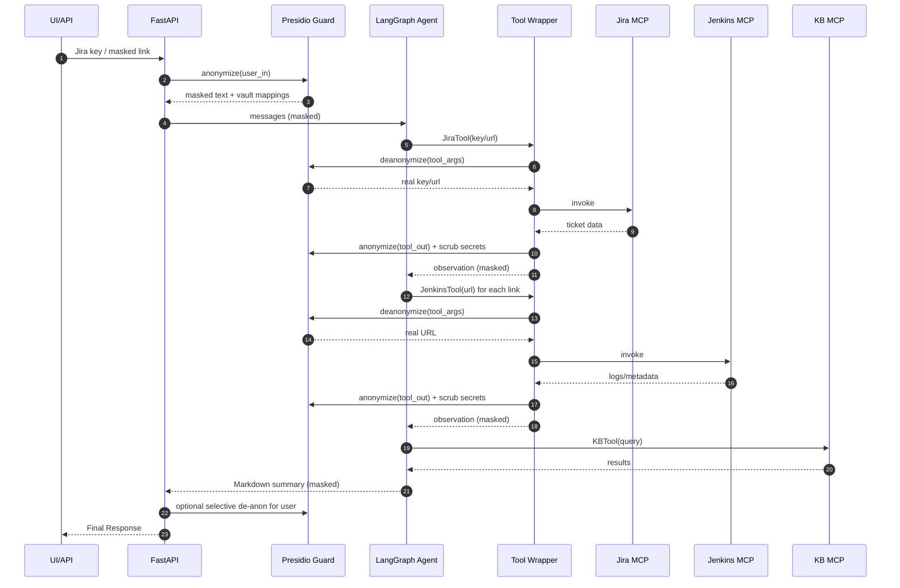

# **JAD Module Prep Canvas** — Agentic Reasoning & Orchestration Engine (DevOps Tools Agent)

**Guideline:** One‑page cheat sheet focused on crisp intent, decision logic, and drill‑down readiness.

---

### **01. Core Identity & Mission**

**Module Name:** Agentic Triage & Orchestration Gateway
**Module Owner:** Abhijit / DevOps AI Squad
**Mission Statement (one critical job):**
Act as the secure and intelligent central nervous system that triages incidents by orchestrating Jira, Jenkins, KB, and Git through an LLM—while preserving privacy via deterministic anonymization and irreversible secret scrubbing.

---

### **02. Architectural Blueprint & Data Flow**

**Key Dependencies (its place in the ecosystem):**

* **LangGraph ReAct Orchestrator** (planning & tool routing)
* **MCP Servers/Tools:** `custom_mcp_jira`, `jenkins_mcp`, `KB_mcp`, `git_mcp`
* **Presidio Guard** (masking Jira keys/hosts, secret scrub `[REDACTED_SECRET]`, vault mappings)
* **Wrapper Adapter** (pre‑tool de‑anon, post‑tool re‑anon, schema‑safe args)
* **Tachyon/Model Client** (LLM interface)
* **FastAPI Service** (session lifecycle, cleanup)

**Inputs (receives data/calls from):**

* **Unified AI Assistant UI / API** — user prompts (may contain Jira IDs, Jenkins URLs)
* **System Integrations** — webhooks/automation triggers (e.g., failing build → triage request)

**Outputs (sends data/calls to):**

* **Jira** (ticket summary comment; links to findings)
* **Jenkins** (log fetch; stage & error extraction)
* **KB** (targeted search queries; relevant fixes)
* **User Channels** (Slack/Email/Jira comment — markdown report)

**High‑Level Data Flow Diagram (Mermaid)**
*Crucial for clarity — path of a typical request*

---

### **03. Key Design Principles & Guardrails**

**Core Logic (how it decides):**

* Plan → Act (tool call) → Observe → Replan → Summarize.
* Prefer Jira→Jenkins→KB chain; halt early if confidence high and evidence sufficient.

**Escape/Guardrail (security & safety):**

* Secrets never reach the LLM: password/token/Auth/cookie → `[REDACTED_SECRET]` (non‑rehydratable).
* Identifiers masked for LLM (`<<JIRA_KEY_xxxx>>`, `https://<<HOST_xxxx>>/...`) and deterministically rehydrated only at tool boundary.
* Strips non‑schema args before tool invoke; multi‑namespace lookup prevents SID drift.
* Fallback behavior: if a tool fails, continue with available evidence and mark gaps.

**Reliability/Quality:**

* Contract‑tested MCP schemas; retries with backoff.
* Structured markdown output even when partial; link raw sources.
* Per‑session vault TTL + post‑response purge.

---

### **04. Critical Assumptions & Open Questions**

**Assumptions:**

1. Presidio recognizers achieve ≥99% secret redaction on expected inputs.
2. Jenkins hosts and Jira keys can be deterministically mapped within a session.
3. Teams accept masked identifiers in LLM-visible text; de‑anon occurs only in tool calls or selective user display.

**Open Questions:**

1. What TTL by namespace balances multi‑turn utility vs. privacy? (`tool_args` vs. `tool_out`).
2. Should we persist hashed/attested artifacts for compliance?
3. Where to encode domain heuristics (e.g., flaky classifier): prompt vs. dedicated tool?

---

### **05. Self → UI: Final Response (Shape)**

* **Jira Information** (link, reporter, description highlights, key comments)
* **Ticket Summary (LLM)** (4–6 sentences, masked IDs)
* **Jenkins Information** (masked links; failing stage, error signatures, timestamps)
* **Generated KB Queries** (top 5)
* **KB Findings** (2–5 concise bullets w/ relevance)
* **Overall Summary** (hypothesis, next actions, owners)

---

### **06. KPIs for Reviewers**

* MTTR delta on P1/P2; redaction hit‑rate; agent success rate; tool latency; adoption.

---

### **07. Appendix — Operational Notes**

* BackgroundTasks purge: `purge_session(session_id)` post‑response (all namespaces when needed).
* Observability: trace by `session_id`; count redactions; log tool invocations and retries.
* Change Management: pilot → harden → preview; contract tests for MCP; prompt reviews for safety.
