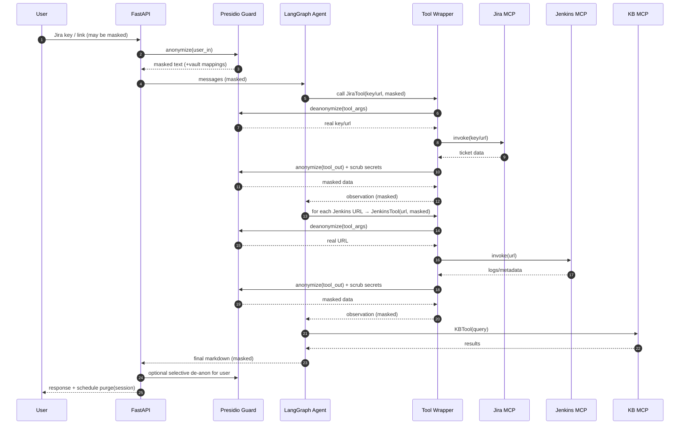
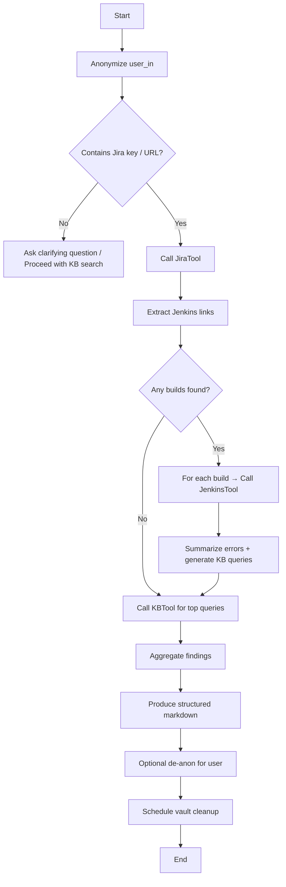

# Agentic Reasoning & Orchestration Engine — Design Document

**Owner:** Abhijit / DevOps AI Squad
**Version:** 1.0 (Nov 2025)
**Audience:** Automation & DevOps engineers, platform owners, SREs

---

## 1) Executive Summary

This document describes the architecture, reasoning patterns, security controls, and operational model for a tools‑powered
DevOps agent. The system uses a ReAct‑style agent orchestrated with LangGraph, MCP servers for system integration (Jira, Jenkins, KB, Git), and a Presidio‑based privacy layer that anonymizes inputs/outputs while enabling just‑in‑time de‑anonymization for tool calls. The goal is to reduce MTTR and toil while preserving data‑handling safety.

---

## 2) Goals & Non‑Goals

**Goals**

* Automate incident triage across Jira+Jenkins+KB with structured, reproducible outputs.
* Provide actionable summaries (root‑cause hypotheses, next steps, owners) in <5 minutes.
* Enforce data minimization: secrets never reach the LLM; sensitive identifiers are masked for the LLM but restored for tools.
* Be debuggable, testable, and extensible (add tools without re‑architecting).

**Non‑Goals**

* Replace human approvals for production changes.
* Serve as a long‑term memory store. (Ephemeral, per‑session mappings with TTL/cleanup.)
* Satisfy every CI/CD system on day one (we start with Jira/Jenkins/KB, expand later).

---

## 3) High‑Level Architecture

* **Agent Orchestrator (LangGraph ReAct):** Drives reasoning loop (plan → act → observe → reflect). Routes to tools based on system prompt + intermediate state.
* **MCP Servers / Tools:**

  * `custom_mcp_jira`: look up tickets, fields, comments, links.
  * `jenkins_mcp`: fetch build logs/metadata.
  * `KB_mcp`: search internal KB.
  * `git_mcp`: (optional) diffs, blame, PR metadata.
* **Privacy/Anonymization (Presidio Guard):**

  * Deterministic placeholders: `<<JIRA_KEY_xxxx>>`, `https://<<HOST_xxxx>>/...`
  * Non‑rehydratable SECRET scrub: passwords, tokens, Authorization headers → `[REDACTED_SECRET]`.
  * Namespace vault (SQLite): `user_in`, `tool_args`, `tool_out`, `final_out` with HMAC tags and per‑session TTL cleanup.
* **Wrapper Adapter:**

  * Deep de‑anonymization of tool kwargs (multi‑namespace) just before tool call.
  * Re‑anonymization of tool outputs before the LLM sees them.
  * Strips non‑schema keys (e.g., `anonymizer_session_id`) to prevent StructuredTool KeyError.
* **FastAPI Service:**

  * Request lifecycle: generate `session_id` → anonymize input → agent execution → de‑anonymize for user as needed → schedule vault cleanup.

---

## 4) Reasoning & Orchestration Model

**ReAct + Guardrails**

* **Planner:** Given the user request (e.g., Jira key), plan calls: Jira → Jenkins (per link) → KB queries → summarize.
* **Actor:** Executes tool calls through MCP; wrapper enforces privacy and arg canonicalization.
* **Critic:** Validates intermediate outputs (e.g., does Jenkins result contain error signatures?). If not, revise plan.
* **Stop Conditions:** Cap tool loops by count and confidence; always produce a useful partial summary.

**State Machine (LangGraph sketch)**

* `Start → Plan → ToolCall → Observe → (Replan | Summarize) → End`
* Error edge: `ToolCall → ErrorHandler → (Retry | Skip) → Observe`

**Prompt Directives (Key)**

* Preserve placeholders exactly; do not expand or strip `<< >>`.
* Use canonical arg names (`url`, `key`/`tool_input`, `query`).
* Avoid secrets in generations; render `[REDACTED_SECRET]` if needed.

---

## 5) Data Flow (End‑to‑End)

1. **User → API**: Request arrives. Create `session_id`; set `CURRENT_SESSION_ID`.
2. **Anonymize (user_in)**: Presidio masks Jira keys/hosts; scrubs secrets. Mappings mirrored into `tool_args`.
3. **Agent Reasoning**: Plans Jira → Jenkins → KB calls.
4. **Wrapper (pre‑tool)**: Deep de‑anon kwargs via `deanonymize_text_multi(..., ["tool_args","user_in","tool_out","final_out"])`; strip extra keys; invoke tool.
5. **Wrapper (post‑tool)**: Re‑anonymize tool outputs (`tool_out`); scrub secrets.
6. **LLM Summarization**: Produces markdown with masked identifiers.
7. **User Response**: Optionally de‑anon selected fields for user; never unmask secrets.
8. **Cleanup**: `BackgroundTasks.add_task(purge_session, session_id)` removes vault entries post‑response or on TTL.

---

## 6) Process Diagrams (Mermaid)

### 6.1 Sequence (Agentic Triage)

### 6.2 Flowchart (Decisioning)

---

## 7) Component Details

**7.1 Tool Wrapper**

* Deep map over `args/kwargs` to deanonymize strings; recursive for lists/dicts.
* Multi‑namespace lookup order: `tool_args → user_in → tool_out → final_out`.
* Strip non‑schema keys (e.g., `anonymizer_session_id`) before invoking StructuredTool.
* Re‑anonymize tool outputs; scrub secrets; ensure idempotency.

**7.2 Presidio Guard**

* Recognizers: JIRA, Jenkins (nested + BlueOcean), generic URLs, EMAIL/IP/PHONE, SECRET.
* Overlap resolver: JIRA wins over noisy entities; SECRET has highest priority.
* Secret scrubber: irreversible; `%password%`, `maskPasswords`, `Authorization: Bearer …`, JWTs, cookies.
* Jenkins fallback host masker stores host mapping; never re‑masks placeholders.

**7.3 Vault**

* Schema: `(session_id, namespace, entity_type, placeholder, original, created_at)`.
* Deterministic HMAC tag over `(session|entity|original)` → `<<ENTITY_tag>>`.
* Cleanup: per‑request (BackgroundTasks) and nightly TTL (script).

**7.4 Agent Policies**

* Tool‑loop caps, retry budget, and backoff.
* Structured outputs guaranteed (sections present even if partial).
* Safety: never print secrets; render `[REDACTED_SECRET]`.

---

## 8) Security & Privacy

* **Data minimization:** Only masked identifiers reach the LLM; secrets are scrubbed.
* **Just‑in‑time access:** Real values exist only at tool boundaries.
* **Auditability:** All tool calls + transformations are loggable.
* **Config:** HMAC secret via env (`ANON_HMAC_SECRET`), DB path via `ANON_VAULT_DB`.
* **Revocation:** `purge_session(session_id)` removes all mappings.

---

## 9) Observability

* **Tracing:** Correlate by `session_id`; log wrapper steps (pre/post tool; counts redacted).
* **Metrics:** tool latency, retries, redaction hit‑rate, SECRET incidents, MTTR deltas.
* **Dashboards:** agent success rate, top error signatures, flaky test leaderboard.

---

## 10) Performance & Limits

* **Parallelism:** fan‑out Jenkins calls; cap inflight.
* **Caching:** memoize identical KB queries per session.
* **Time bounds:** max tool loop steps; partial results allowed.
* **Cold start:** preload MCP servers on app startup.

---

## 11) Failure Modes & Handling

* **Tool schema drift:** wrapper validation error → contract test; fallback to raw link.
* **Unresolvable placeholders:** return masked value with note; suggest manual rerun.
* **Secret found post‑tool:** redact and flag; block from LLM/user.
* **Vault corruption:** fail closed (no deanonymization); user sees masked output; alert platform.

---

## 12) Rollout & Change Management

* **Pilot** 2 squads → measure MTTR/toil deltas.
* **Hardening**: add Git/Change‑Calendar tools; KB cache; prompt refinements.
* **Org Preview**: training, playbooks, and contract‑tested MCP integrations.
* **Governance**: privacy reviews, secret pattern updates, incident runbooks.

---

## 13) Open Questions

* How to encode domain‑specific heuristics (e.g., flaky classifier) as reusable tools vs. prompts?
* Should we persist anonymized artifacts for compliance (hashed transcripts)?
* What’s the right TTL per namespace (e.g., keep `tool_args` for multi‑turn; purge `tool_out` quickly)?

---

## 14) Appendix — Prompt (Agent System Message)

* Preserve placeholders exactly as seen (`<<JIRA_KEY_xxxx>>`, `https://<<HOST_xxxx>>/...`).
* Use canonical tool args: `key`/`tool_input` (Jira), `url` (Jenkins), `query` (KB).
* Do not include non‑schema extras (wrapper manages session internally).
* Never print secrets; use `[REDACTED_SECRET]`.
